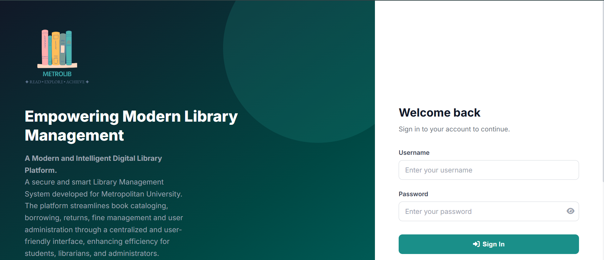
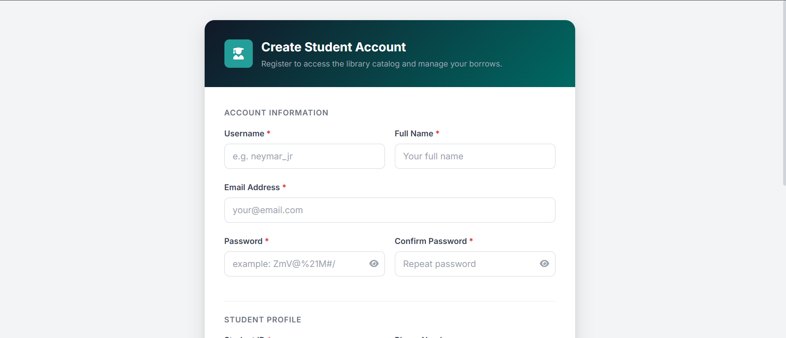
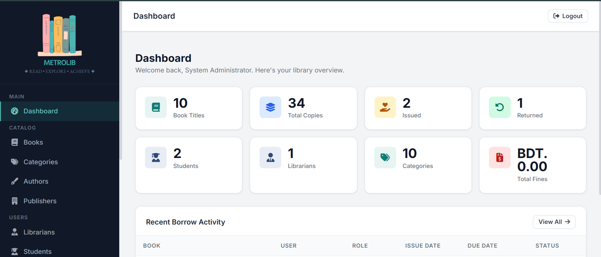
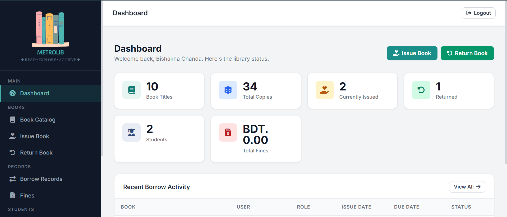
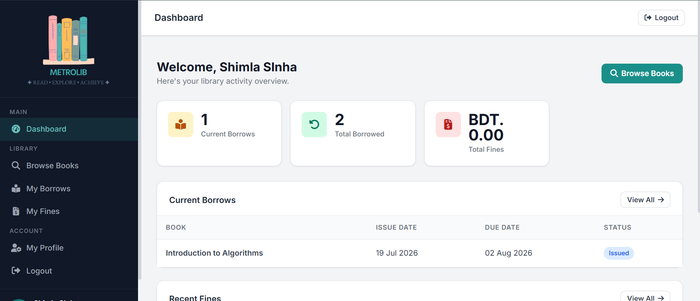

# 📚 University Library Management System

A modern, secure, and responsive web-based Library Management System developed using **Flask** and **MySQL**. The system streamlines academic library operations by providing dedicated dashboards and role-based access for **Administrators, Librarians, and Students**.

## 📖 Overview

The University Library Management System is designed to automate and simplify day-to-day library operations. It provides an intuitive interface for managing books, users, borrowing records, overdue fines, and reports while maintaining data integrity through secure authentication and role-based authorization.

This project follows a clean MVC-inspired architecture using Flask Blueprints, making the application modular, scalable, and easy to maintain.

## ✨ Key Features

### 👨‍💼 Administrator

- Secure authentication
- Interactive dashboard with library statistics
- Complete Book Management (CRUD)
- Category Management
- Author Management
- Publisher Management
- Manage Librarian Accounts
- Manage Student Accounts
- View Student Profiles
- Borrow History Management
- Book Report
- Fine Report
- Printable Reports
- Profile & Password Management

### 📚 Librarian

- Secure Login
- Dashboard with Recent Activities
- Search Books
- Issue Books
- Return Books
- Automatic Fine Calculation
- Borrow Record Management
- Student Search
- Student Profile View
- Fine Management
- Profile Update

### 🎓 Student

- Student Registration
- Secure Login
- Personal Dashboard
- Browse Library Catalog
- Advanced Book Search
- View Available Books
- Borrow History
- Fine History
- Update Profile
- Change Password

## 🔐 Authentication & Security

- Role-Based Access Control
- Secure Password Hashing
- Session Management
- Protected Routes using Middleware
- Input Validation
- Duplicate Borrow Prevention
- Error Handling
- Authentication Middleware

## 📊 Reporting System

The system includes built-in printable reports for:

- 📚 Book Report
- 📖 Borrow History Report
- 💰 Fine Report

## ⚙️ Technology Stack

| Category | Technology |
|-----------|------------|
| Backend | Flask 3 |
| Database | MySQL |
| Frontend | HTML5, CSS3, JavaScript |
| Template Engine | Jinja2 |
| Authentication | Werkzeug Password Hashing |
| Database Driver | mysql-connector-python |
| Icons | Font Awesome |

## 🏗️ Project Architecture

```
project/
│
├── app.py
├── config/
├── controllers/
├── database/
├── middleware/
├── models/
├── routes/
├── static/
├── templates/
├── utils/
├── requirements.txt
└── library_management.sql
```

The project follows a modular architecture where each component is separated into dedicated folders for better maintainability and scalability.

## 🚀 Installation

### Install Dependencies

```bash
pip install -r requirements.txt
```

### Configure Environment

Create a `.env` file and update the database configuration.

```
DB_HOST=localhost
DB_PORT=3306
DB_NAME=library_management
DB_USER=root
DB_PASSWORD=your_password
SECRET_KEY=your_secret_key
```

### Import Database

Import

```
library_management.sql
```

into MySQL.

### Run the Application

```bash
python app.py
```

Open your browser:

```
http://127.0.0.1:5000
```


## 👤 Default Administrator Account

| Username | Password |
|----------|----------|
| admin | Admin@123 |

## 📸 Screenshots

Add screenshots of:

- Home Page
- Login Page
- Admin Dashboard
- Librarian Dashboard
- Student Dashboard
- Book Management
- Issue Book
- Borrow History
- Reports

---

## 🌟 Highlights

- Modern Responsive UI
- Role-Based Dashboard
- Modular Flask Architecture
- Secure Authentication
- Automatic Fine Calculation
- Printable Reports
- MVC-inspired Structure
- Easy to Maintain
- Scalable Codebase

---

## 🎯 Future Enhancements

- Email Notifications
- QR Code / Barcode Integration
- Book Reservation System
- Email Verification
- PDF Report Export
- Dark Mode
- REST API Support
- Docker Deployment

---

# Screenshot

## Login Page


## Create account Page


## Admin portal


## Librarian portal


## Student portal


## 👨‍💻 Developed By

**Shimla Sinha**<br>
**Bishakha Chanda**

Department of Computer Science & Engineering

**Metropolitan University, Bangladesh**

---
